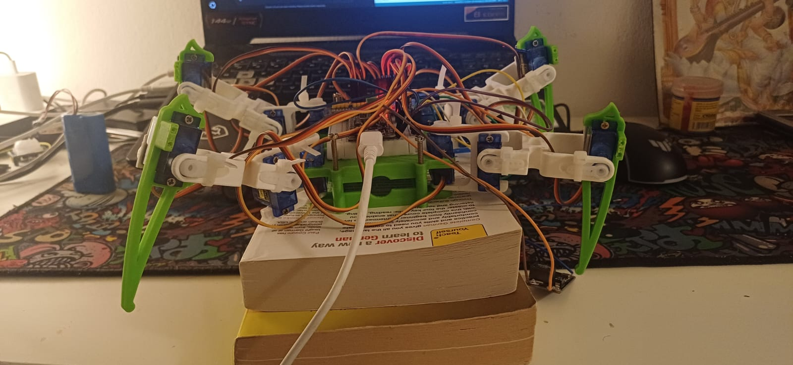
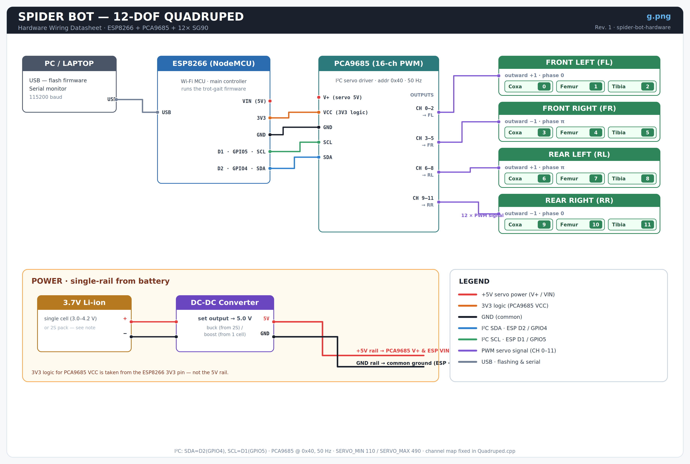

# Spider Bot — 12-DOF Quadruped (Hardware + Firmware)

Physical build and **ESP8266 firmware** for a 12-DOF quadruped spider robot.
The analytical inverse kinematics and trot gait are ported one-to-one from the
ROS 2 / Gazebo simulation, so the real robot runs the *same* math the simulation
was validated with.

> ### 🔗 Companion repository — ROS 2 / Gazebo simulation
> The URDF, `ros2_control` setup, IK derivation notebooks and the Gazebo demo live in
> a separate repo so the simulation and the hardware stay easy to follow independently:
>
> **https://github.com/2003one/Spier_Ros_simulation**
>
> This repo (`spider-bot-hardware`) is **only** the physical build + ESP8266 firmware.

---

## The Robot



A four-legged walker with 3 joints per leg (Coxa → Femur → Tibia = 12 DOF), driven
by 12 micro-servos through a PCA9685 PWM driver, controlled by an ESP8266.

---

## Wiring



### Bill of Materials

| Qty | Part | Notes |
|----|------|-------|
| 1 | ESP8266 (NodeMCU / Wemos D1 mini) | main controller |
| 1 | PCA9685 16-channel PWM driver | I²C address `0x40`, 50 Hz |
| 12 | SG90 / MG90 micro-servo | 3 per leg |
| 1 | DC-DC converter → 5 V | powers servo rail + ESP |
| 1 | 3.7 V Li-ion battery | see **power note** below |
| — | 3D-printed frame + horns | Coxa 35 mm · Femur 70 mm · Tibia 75 mm |

### I²C connection (ESP8266 → PCA9685)

| ESP8266 pin | Signal | PCA9685 pin |
|-------------|--------|-------------|
| D2 · GPIO4  | SDA    | SDA |
| D1 · GPIO5  | SCL    | SCL |
| 3V3         | logic  | VCC |
| GND         | ground | GND |

I²C pins are set in firmware with `Wire.begin(4, 5)` — **SDA = GPIO4, SCL = GPIO5**.

### Servo channel map (fixed in `Quadruped.cpp`)

| Leg | outward_sign | phase | Coxa | Femur | Tibia |
|-----|:---:|:---:|:---:|:---:|:---:|
| **FL** — Front Left  | +1 | 0 | CH 0 | CH 1 | CH 2 |
| **FR** — Front Right | −1 | π | CH 3 | CH 4 | CH 5 |
| **RL** — Rear Left   | +1 | π | CH 6 | CH 7 | CH 8 |
| **RR** — Rear Right  | −1 | 0 | CH 9 | CH 10 | CH 11 |

Diagonal pairs share a phase → **FL + RR** move together, **FR + RL** move together (trot).

### ⚡ Power note

Servos are powered from a **5 V rail**, not the ESP.
The `V+` pin on the PCA9685 and the ESP `VIN` come from the DC-DC converter output;
the PCA9685 `VCC` (logic) is taken from the ESP `3V3` pin. **All grounds are common.**

Set the converter output to what your servos expect (~5 V). Whether you need a **buck**
or a **boost** depends on your pack: a single 3.7 V cell (3.0–4.2 V) needs a **boost** to
reach 5 V; a 2S pack (7.4 V) needs a **buck**. Update the converter block in `g.png` to
match your actual battery before presenting.

> ⚠️ Never power 12 servos from the ESP's 3V3/USB rail — stalls will brown-out the MCU.

---

## Firmware

### Bring-up sequence (do this in order)

1. **Neutral centering** — flash [`PCA9685_Test.ino`](PCA9685_Test.ino).
   It drives all 12 channels to neutral (1500 µs) and holds them there, so you can
   mount every servo horn against a known reference before assembly.
2. **Calibrate** — in `Config.h` set `CALIBRATION_MODE 1`, flash the main firmware.
   All joints hold at 0 rad (the URDF zero pose). Tune `SERVO_DIRECTION[]` and
   `SERVO_OFFSET[]` in `Calibration.h` until every leg hangs straight down.
3. **Walk** — set `CALIBRATION_MODE 0`, flash again. The robot then runs:

```
zero pose (legs straight)  ──►  stand up (smoothstep, 2 s)  ──►  trot gait loop
```

### Code structure

```
spider-bot-hardware/
├── spider.ino            ← entry point (setup + 50 Hz update loop)
├── PCA9685_Test.ino      ← bring-up: all servos → neutral
├── Quadruped.{h,cpp}     ← leg table, stand-up, per-leg update
├── IK.{h,cpp}            ← analytical IK  +  IK→servo-angle mapping
├── Gait.{h,cpp}          ← gait phase  +  swing/stance foot trajectory
├── ServoController.{h,cpp} ← PCA9685 driver: angle → pulse (dir + offset)
├── Config.h              ← dimensions, home pose, gait params, PWM limits
├── Calibration.h         ← per-servo direction & offset tables + procedure
├── Types.h               ← shared structs
└── Utils.h               ← angle helpers
```

### Inverse kinematics (identical to the ROS 2 node)

Given a target foot position `(px, py, pz)` in the leg frame:

```
θ1 (coxa)  = atan2(py, px)
d          = √( (r − L1)² + pz² )            r = √(px² + py²)
θ3 (knee)  = acos( (d² − L2² − L3²) / (2·L2·L3) )     ← cosine rule
θ2 (hip)   = atan2(−pz, r − L1) − atan2( L3·sinθ3, L2 + L3·cosθ3 )
```

Then mapped to servo angles (same mapping as the simulation), with `outward_sign`
applied to **all three** joints so the right-side legs mirror correctly:

```
coxa  = sign · (θ1 − π/2)
femur = sign · (π/2 − θ2)
tibia = − sign · θ3
```

On hardware the reachability check *clamps* `d` to the leg's limits instead of throwing,
so a marginally out-of-range target degrades gracefully rather than freezing the loop.

### Trot gait

Each foot follows a swing/stance cycle per gait period:

```
SWING  [0, π)   foot lifts in a sine arc and steps forward
STANCE [π, 2π)  foot stays down and pushes back → body moves forward
```

### Tunable parameters (`Config.h`)

| Parameter | Default | Effect |
|-----------|---------|--------|
| `L1 / L2 / L3` | 35 / 70 / 75 mm | link lengths |
| `HOME_PY` | 0.08 m | stance width |
| `HOME_Z` | −0.10 m | crouch height |
| `STEP_LENGTH` | 0.03 m | stride length |
| `STEP_HEIGHT` | 0.015 m | foot lift |
| `GAIT_HZ` | 0.5 | gait cycles per second (0 = stand still) |
| `STAND_UP_TIME` | 2.0 s | fold-to-stance duration |
| `SERVO_MIN / SERVO_MAX` | 110 / 490 | PCA9685 pulse range |

---

## Build & Flash (Arduino IDE)

1. Install the **ESP8266 board package**
   (Boards Manager URL: `http://arduino.esp8266.com/stable/package_esp8266com_index.json`).
2. Install the **Adafruit PWM Servo Driver Library** (Library Manager → search *PCA9685*).
3. Open `spider.ino`, keep all `.h/.cpp` files in the same sketch folder.
4. Select your ESP8266 board, set **115200 baud**, and upload.

---

## Outputs

| File | What it is |
|------|-----------|
| `s.jpeg` | photo of the assembled robot |
| `g.png`  | hardware wiring datasheet (this repo) |
| `o.png`  | Gazebo simulation output — see the [simulation repo](https://github.com/2003one/Spier_Ros_simulation) |

---

## Author

**Anup** — MSc CS, Robotics & Automation, HAM Munich

All hardware dimensions, IK mathematics, gait parameters and design decisions are the
author's own work. Portions of the tooling (URDF scaffolding, wiring datasheet) were
prepared with assistance from Claude (Anthropic).

## License

MIT
